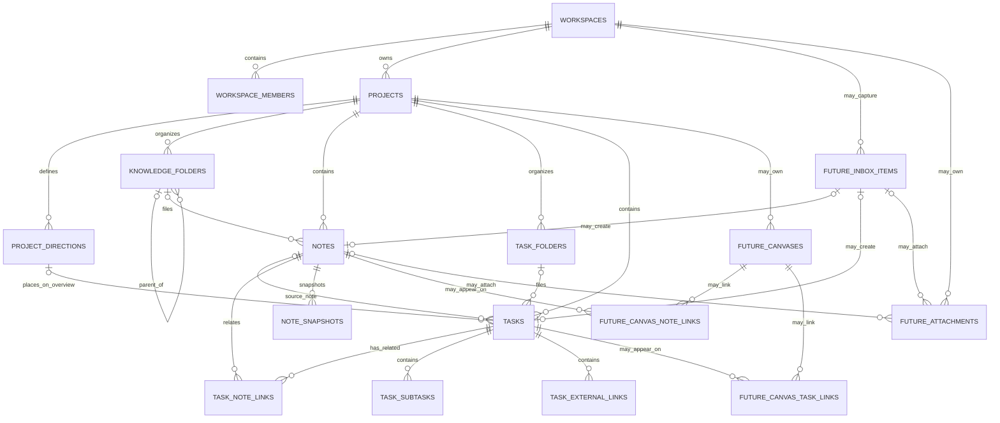

# Core MVP Data Model Contract

- Status: proposed for owner review
- Production baseline: `origin/main` at `3394198a0632e3cc07f9abc1bfa8aeb33215e499`
- Prototype evidence: `b5768898069b89cdb76dc0e152be4b5ee90b700a`
- Scope: Overview, Knowledge, and Tasks only

This document is a logical contract, not a migration. It distinguishes deployed production behavior from frozen architecture, mock-only prototype behavior, and proposed Core MVP work. It does not change the decisions frozen in `ARCHITECTURE.md` §18.

## 1. Executive summary

The Core MVP is one project workspace expressed through three mutually reinforcing views:

- **Knowledge** stores durable project thinking as Markdown notes arranged in a nested folder tree.
- **Tasks** stores durable executable work as task rows, including completion, importance, signal, manual order, subtasks, links, and note relationships.
- **Overview** presents a deliberately small subset of those same task rows in one to four project-specific directions, manually ordered by priority.

Together these views are sufficient for a controlled real-project pilot: knowledge can be written and found, work can be planned and completed, and the project's current directions can be reviewed without creating duplicate records. Overview is not a second task database. An article shown in Knowledge is a `notes` row, and a task shown in Overview and Tasks is one `tasks` row.

Canvases, Inbox, AI, transcription, public sharing, attachments UI, automatic capture, and broad offline editing are postponed. The Core schema must nevertheless retain stable UUIDs, workspace-safe relationships, archive state, exportable Markdown, and explicit extension seams so future modules can link to pilot data rather than copy or replace it.

The production foundation and the approved prototype serve different purposes:

- Production `main` already provides the multi-tenant schema foundation, project and note tables, signup bootstrap, RLS tests, generated types, and a tested Markdown parser/serializer. It does not yet provide production product workflows.
- The prototype checkpoint demonstrates the intended interaction model with mock arrays and a reducer. It is not a production persistence model, has no server writes, and resets after reload.

The Core MVP should promote proven product concepts from the prototype into the production model while preserving the frozen Markdown/task contract. Promotion must happen through small migrations and feature PRs, never by merging the prototype state model wholesale.

## 2. Verified current state

The classification labels used throughout this document are:

- **Implemented on `main`** — present in production-branch code, migration, or test.
- **Defined by frozen architecture** — specified by `ARCHITECTURE.md` v1.2 but not necessarily implemented.
- **Prototype-only** — present only at checkpoint `b576889…` and reset after reload.
- **Proposed for Core MVP** — recommended by this contract and still requiring implementation review.
- **Postponed** — deliberately outside Core MVP.

### 2.1 Production schema and security

| Verified statement | Classification | Evidence and implication |
| --- | --- | --- |
| `workspaces` and `workspace_members` exist; membership roles are `owner`, `editor`, and `viewer`. | Implemented on `main` | Migration `20260710161809_workspaces_members_rls_foundation.sql`. Ownership is membership-based; there is no `workspaces.owner_id`. |
| RLS is enabled on workspaces and memberships, with `SECURITY DEFINER` membership helpers using fixed `search_path`. | Implemented on `main` | `is_workspace_member` and `has_workspace_role`; grants are deliberately narrow. |
| The last owner cannot be removed or demoted, and membership `workspace_id` cannot change. | Implemented on `main` | Trigger-backed invariants and real pgTAP integration coverage. |
| `projects` and `notes` exist with workspace ownership and a composite note-to-project FK. | Implemented on `main` | Migration `20260710205257_projects_notes_user_bootstrap.sql`. |
| Notes persist `content_md`, `version`, archive state, daily-note fields, share token, timestamps, and generated `search_tsv`. | Implemented on `main` | FTS combines `russian` and `simple`, with a GIN index. |
| Active note titles are case/whitespace-normalized unique within a project; active daily notes are unique by date. | Implemented on `main` | Partial unique indexes exclude archived notes. |
| Signup atomically and idempotently creates a workspace and owner membership. | Implemented on `main` | Private security-definer bootstrap and `auth.users` trigger. |
| RLS tests cover anonymous, owner, editor, viewer, outsider, bootstrap, cross-workspace rejection, and prohibited writes. | Implemented on `main` | `tests/rls/workspaces-members.test.sql` and `tests/rls/projects-notes-bootstrap.test.sql`. |
| The generated database types contain only workspaces, memberships, projects, and notes. | Implemented on `main` | `src/lib/supabase/database.types.ts`; there are no generated task/folder/direction types. |
| User deletion is archive-first and workspace boundaries require composite FKs, RLS, and code checks. | Defined by frozen architecture | `ARCHITECTURE.md` §18. Existing project/note tables have `archived_at`; normal production archive services are still absent. |

Important limitation: the migrations grant select/insert/update according to the current foundation, but there is no production repository/service/UI implementing project or note CRUD, archive/restore, search, or membership workflows. Schema capability must not be described as finished product behavior.

### 2.2 Production routes and Markdown functionality

| Verified statement | Classification | Evidence and implication |
| --- | --- | --- |
| The App Router exposes only a foundation smoke page. | Implemented on `main` | `src/app/page.tsx` renders “Каркас проекта готов”; no authenticated project routes exist. |
| Typed browser and server Supabase clients use only public URL and anon key. | Implemented on `main` | `src/lib/supabase/browser.ts`, `server.ts`, and `env.ts`; no service-role client enters the browser bundle. |
| Markdown parse/serialize APIs and typed task/wiki reference extraction exist. | Implemented on `main` | `src/lib/markdown/*`. Markdown remains the persisted source of truth. |
| Golden round-trip tests cover Russian/English text, formatting, lists, task UUIDs, wiki-links, code exclusions, CRLF, malformed markers, duplicates, and stable second serialization. | Implemented on `main` | `tests/markdown-roundtrip/*`; semantic wiki-links are structural nodes and stale metadata cannot rewrite content. |
| The parser never generates task IDs and the server does not insert IDs into Markdown. | Implemented on `main` and defined by frozen architecture | The parser only recognizes valid final `^task-<uuid>` markers. |
| TipTap UI, note save handler, snapshots, optimistic-concurrency UI, FTS query/UI, archive UI, and export endpoint are absent. | Proposed for later Core MVP PRs | They are specified in Stage 1A, but are not implemented on the audited `main`. |
| A production `tasks` table and task synchronization are absent. | Defined by frozen architecture, not implemented | Architecture places them in Stage 1B. Core MVP requires them before real daily use. |

### 2.3 Approved prototype behavior

| Verified statement | Classification | Evidence and implication |
| --- | --- | --- |
| The desktop prototype stores projects, directions, tasks, task folders, Knowledge folders, documents, canvases, and Inbox items in one reducer state. | Prototype-only | `desktop-state.ts` and `desktop-mock-data.ts`. The prototype override explicitly says state resets after reload. |
| Overview and Tasks use the same `PrototypeTask[]`; stars, signals, completion, titles, links, subtasks, and attached documents update the same object. | Prototype-only, proposed contract | This shared identity is the most important behavior to preserve in production. |
| Each project exposes one to four ordered, renameable directions; Overview hides completed tasks and supports exact cross-direction insertion. | Prototype-only | `overviewDirectionId` plus `overviewOrder`; DnD normalizes each affected direction. |
| Direction visibility, expanded card, board scroll, open panel, and contextual reader origin are reducer/UI state, not domain records. | Prototype-only | `overviewHiddenDirectionIds`, `overviewExpandedTaskId`, `overviewScrollLeft`, and reader IDs. |
| Tasks has a global project manual order, smart filters, optional task folders, completion, importance, signal, and an editor panel. | Prototype-only | `taskListOrder`, `taskFolderId`, `completedAt`, `starred`, and `signal`. |
| Knowledge has nested paths, document order, tree search, tabs, two panes, edit-mode identity, and contextual task/article linking. | Prototype-only | Paths are arrays and some initial folder paths are hard-coded overrides; this is useful UX evidence but unsuitable persistence. |
| Task/article attachment rejects duplicates and cross-project links. | Prototype-only, proposed contract | `linkedDocumentIds` plus reducer validation. |
| The contextual Overview reader preserves the hidden board and task context while switching among attached articles. | Prototype-only UI pattern | The relationship is durable; reader origin, collapse state, and scroll positions are UI state. |
| Prototype tests cover shared task state, ordering, cross-project rejection, links, subtasks, folders, Knowledge moves, panes, and reader state. | Prototype-only verification | `tests/desktop-prototype-state.test.ts`; these are reducer tests, not persistence or RLS tests. |

### 2.4 Current persistence limitations and integration debt

- **Prototype-only:** every product mutation is in-memory. Reload, deployment, another browser, or another user loses it.
- **Missing from both implemented layers:** production directions, Knowledge folders, task folders, tasks, subtasks, external task links, and additional task-note relationships.
- **Defined but not implemented:** safe note autosave, version-conflict handling, snapshots, archive/restore services, owner export, and backup automation.
- **Integration debt:** the prototype represents Markdown as `string[]` and renders a limited handwritten preview. Production has a canonical Markdown pipeline. Production must use `content_md`; it must not persist or promote the prototype renderer's line-array representation.
- **Integration debt:** prototype folder identity is a derived string path. Production needs immutable folder UUIDs so rename/move does not rewrite relationships.
- **Integration debt:** prototype task and subtask IDs are deterministic mock strings. Production task IDs must follow the frozen client-generated UUID contract; other persisted entities should also use stable UUIDs.
- **Integration debt:** the prototype physically deletes tasks in reducer state. Production user deletion must archive the task.

## 3. Core MVP boundaries

### 3.1 Required before the first real project

1. **Authentication and workspace bootstrap:** already schema-tested; add authenticated routing and session handling.
2. **Project CRUD:** create, rename, order, archive, restore, and active-project selection backed by `projects`.
3. **Project directions:** one to four renameable, ordered directions per project, with stable IDs.
4. **Knowledge folder CRUD:** nested, ordered, stable-ID folders with safe rename/move and cycle prevention.
5. **Markdown article CRUD:** notes load and save `content_md`; create, rename, move, order, archive, and restore.
6. **Safe note save:** expected-version update, explicit save state, conflict response, and no silent overwrite.
7. **Task foundations:** one production `tasks` table with CRUD, archive, completion, importance, signal, task-list order, optional direction, optional folder, and the frozen `note_id` relationship.
8. **Task details:** persisted subtasks, external links, source note, and additional related notes.
9. **Overview:** a view of production task rows assigned to directions, with independent Overview order.
10. **RLS and composite FKs:** real integration tests for every new table and every cross-workspace/cross-project relationship.
11. **Manual export:** versioned Markdown plus JSON for workspace, projects, directions, folders, tasks, relations, and archive state.
12. **Recoverability baseline:** database backup, Storage inventory even if empty, written restore procedure, and one verified restore before irreplaceable data entry.

### 3.2 Required during the controlled pilot

- Note snapshots with bounded retention and restore UI.
- GIN-backed note search and project-scoped navigation; basic task-title search may be added without semantic search.
- Archive browsing and restore for projects, notes, folders, tasks, subtasks, and links where applicable.
- Operational monitoring for failed saves, failed backups, and storage growth.
- Cross-device verification of ordering and relationships.
- Export compatibility tests and at least one additional restore rehearsal after meaningful pilot data exists.
- Usability fixes necessary for the three core workflows, without promoting incidental UI state to the domain schema.

### 3.3 Intentionally postponed

- Canvases and tldraw persistence.
- Inbox capture, Web Share Target, voice, transcription, retry queue, and idempotent offline delivery.
- AI panels and AI writing.
- Public sharing and share-management UI.
- Full offline note editing, CRDT, realtime collaboration, and offline conflict resolution.
- Backlinks graph, embeddings, semantic search, and cross-workspace discovery.
- Attachments upload UI. The export format must still reserve an attachment manifest and the schema seam must remain compatible.

## 4. Domain glossary

| Term | Canonical definition |
| --- | --- |
| Workspace | Tenant and security boundary. A user accesses it only through `workspace_members`. |
| Project | A workspace-owned container for Core MVP knowledge and tasks. |
| Project direction | A stable, project-owned Overview lane representing a major working direction, not a time status. One project has one to four active directions. |
| Knowledge folder | A stable-ID, project-owned node in a nested article hierarchy. Its path is derived from parent relationships, never its identity. |
| Note | The production database entity in `notes`; Markdown in `content_md` is its source of truth. |
| Article | Product/UI name for a note shown in Knowledge. It is not a second table or copy. |
| Task | A production row in `tasks`; Overview and Tasks render the same row. |
| Source note | The note whose canonical task marker currently anchors or originally created the task. In the current architecture this is `tasks.note_id`. |
| Related note | An additional explicitly attached note that is not the source-marker relationship. |
| Task folder | An optional project-owned organizational container for Tasks. It does not own or duplicate tasks. |
| Task signal | A restrained semantic state with the values `none`, `green`, `yellow`, or `red`; it is independent of importance and order. |
| Overview order | Manual order of an active task inside one project direction. It is independent of Tasks list order. |
| Archive | Reversible user-level removal represented by `archived_at`; it is not ordinary physical deletion. |
| Local UI state | Ephemeral state needed to render a session, such as an expanded card or open popover. It is not domain data. |
| Per-user preference | Non-domain presentation choice scoped to user/workspace/project, such as hidden directions or collapsed panels. It may be locally persisted first and server-synced later. |

## 5. Source-of-truth matrix

| Concern | Source of truth | Derived views or notes |
| --- | --- | --- |
| Project identity, name, color, emoji, order | `projects` row | Active project is route/session state. |
| Direction identity, title, color, order | `project_directions` row | Visibility is per-user preference, not a direction field. |
| Note identity, title, Markdown, folder, order | `notes` plus `knowledge_folder_id` and `sort_order` | Article path is derived from folder parents. Markdown remains authoritative over editor JSON. |
| Task identity, title, body, status, due date, importance, signal | `tasks` row | Completion timestamp follows status; checkbox marker in Markdown is a derived cache. |
| Direction assignment and Overview order | Nullable `tasks.project_direction_id` and `tasks.overview_order` | No direction means not shown on Overview. Completed/archived tasks are filtered out without deleting assignment. |
| Tasks list order | `tasks.sort_order` | One project-global manual order; folder and smart-list views preserve relative order. |
| Task folder | Nullable `tasks.task_folder_id` | Moving a task changes the FK, not task identity. |
| Source note | `tasks.note_id` | Nullable per frozen architecture. It is not a general many-to-many relation. |
| Related notes | `task_note_links` rows | Excludes the source-note semantic; supports order without arrays. |
| Subtasks | `task_subtasks` rows | Ordered child records; not embedded JSON in `tasks`. |
| External links | `task_external_links` rows | Store label and validated HTTP(S) URL; raw URL is not the label. |
| Expanded Overview card | Local component/reducer state | At most one ID; never saved as task data. |
| Active context panel | Route/session state | May be represented in URL when deep-linking is useful. |
| Current filters/search query | URL state when shareable; otherwise session state | Never changes task membership fields. |
| Scroll positions | Session state keyed by view/document | Optional browser-session restoration only. |
| Edit sessions/drafts/selections | Local component state | Persist only committed Markdown or committed domain fields. |

**Invariant:** Overview and Tasks must query the same task IDs. A write through either view updates the same row and invalidates/refetches both query projections. No `overview_tasks` copy table is permitted.

## 6. Verified prototype-to-production gap analysis

| Concept | Checkpoint representation | Production support | Core disposition |
| --- | --- | --- | --- |
| Up to four project directions | `PrototypeOverviewDirection[]`; selector slices to four | None | New normalized table; server transaction enforces maximum four active directions. |
| Direction renaming | Reducer updates `title` | None | Persisted table update; non-empty title; stable ID survives rename. |
| Manual Overview order | `overviewOrder` on task | None | Persist on `tasks`; reorder transaction updates exact target container. |
| Movement between directions | Reducer changes direction ID and normalizes both lanes | None | Server-side/RPC transaction validates same project and rebalances orders. |
| Task importance | `starred: boolean` | Frozen task schema lacks field | Add `is_important boolean not null default false`; does not reorder. |
| Task signal | Four-value string | None | Add constrained field; presentation color remains UI. |
| Expanded cards | One reducer task ID | None needed | Local UI state only. |
| Subtasks | Embedded array on mock task | None | Normalize because they have identity, completion, CRUD, and order. |
| External links | Embedded array with validated HTTP(S) URL | None | Normalize ordered child rows; validate scheme server-side. |
| Multiple related articles | `linkedDocumentIds: string[]` | None | Junction table with same-project composite FKs and explicit order. |
| Task folders | `PrototypeTaskFolder[]` and nullable task FK | None | New table plus nullable FK; archive folder only after moving/unassigning active tasks. |
| Knowledge folders | Derived string paths plus local path overrides | None | New stable-ID adjacency-list table; add nullable folder FK to notes. |
| Nested Knowledge hierarchy | `path: string[]` | None | Parent FK, cycle validation, derived breadcrumbs. Do not persist path as identity. |
| Article ordering | Optional `document.order` within a path | `notes` has no order | Add note sort order indexed by project/folder. |
| Article movement | Reducer rewrites paths and sibling order | None | Transaction changes folder FK and order; title/ID/relationships stay unchanged. |
| Primary and secondary Knowledge panes | Reducer document IDs | None needed | URL/session UI state; split does not create data relationships. |
| Article edit sessions | One editing document ID and textarea draft | Markdown pipeline exists; no editor/save | Local editor state; committed `content_md` plus `version` is authoritative. |
| Contextual Overview reader | Source task ID, preview document ID, per-document scroll map | None | Navigation/session state derived from durable task-note links. |
| Active task selection | Reducer task ID/context panel | None needed | URL/session state; never a task field. |
| Task completion | `completedAt` nullable | Frozen task schema defines status/completed time | Implement architecture contract with consistency check. |
| Task description | Prototype `notes` string | Frozen task schema has `body_md` | Use `body_md`; do not add a parallel `notes` field. |
| `showOnOverview` | Separate mock boolean | None | Prefer nullable direction assignment as membership; avoid redundant boolean unless owner rejects this recommendation. |
| Key article flag | `isKeyDocument` mock boolean | None | Not required by current Core scope; postpone rather than add an unverified field. |

## 7. Proposed logical data model

All identifiers are UUIDs. Every user-owned table has `workspace_id`, RLS, immutable workspace ownership, timestamps, and workspace-safe composite relationships. Exact SQL belongs in later migration PRs.

### 7.1 Existing entities retained

#### `workspaces` and `workspace_members`

Retain the implemented schema, membership helpers, roles, last-owner guard, and bootstrap. No Core field is required. Physical workspace deletion remains an explicit administrative operation, not ordinary UI behavior.

#### `projects`

- **Purpose:** project root for all three Core views.
- **Key/ownership:** `id`; `workspace_id` required and immutable.
- **Fields:** retain `name`, `emoji`, `color`, `sort_order`, `archived_at`, timestamps.
- **Constraints/indexes:** non-empty normalized name; `unique(workspace_id, id)`; index active projects by workspace/order.
- **RLS:** member read; owner/editor create/update; viewer read-only; archive/restore authorization explicit.
- **Deletion:** archive-first. Physical delete only in reviewed administrative cleanup.
- **Migration:** no destructive change; tighten name validation in a later compatible migration only after existing rows validate.
- **Extension seam:** future canvases and Inbox items reference this stable ID.

#### `notes` changes

- **Purpose:** canonical Knowledge article record.
- **Key/ownership:** existing `id`, immutable `workspace_id`, required `project_id`.
- **Existing authoritative fields:** `title`, `content_md`, `version`, daily fields, `archived_at`, `search_tsv`, timestamps.
- **Proposed additive fields:** `knowledge_folder_id uuid null`, `sort_order bigint not null default 0`.
- **FKs:** `(workspace_id, project_id, knowledge_folder_id)` references a folder in the same project; null means project root.
- **Constraints/indexes:** preserve active project-wide title uniqueness and daily uniqueness; add active ordering index `(workspace_id, project_id, knowledge_folder_id, sort_order, id)`.
- **Archive/deletion:** archive-first. Moving or renaming never changes ID. Archiving does not null source-task links.
- **Migration:** add nullable folder FK first, add order with safe default, backfill root order deterministically, then deploy folder-aware reads.
- **Extension seam:** attachments and canvases link by note UUID; Markdown remains portable.

### 7.2 New project organization entities

#### `project_directions`

- **Purpose:** project-specific Overview lanes.
- **Fields:** `id`, `workspace_id`, `project_id`, `title`, optional validated `color`, `sort_order`, `archived_at`, timestamps.
- **Nullability:** ownership/title/order required; color and archive timestamp nullable.
- **Constraints:** non-empty title; unique stable ID within workspace; same-project FK; unique active normalized title per project is recommended; one to four active rows per project enforced by a locked server transaction, not client counting.
- **Ordering/indexes:** index active rows by project/order; deterministic ID tie-breaker.
- **RLS:** same role model as projects.
- **Deletion:** archive after tasks are reassigned or assignment is explicitly cleared. Never delete its tasks.
- **Migration:** bootstrap each existing project with one neutral direction; product-specific default names are UI seed data, not global categories.
- **Extension seam:** future analytics may reference direction ID without changing task identity.

#### `knowledge_folders`

- **Purpose:** stable nested Knowledge hierarchy.
- **Fields:** `id`, `workspace_id`, `project_id`, `parent_id null`, `title`, `sort_order`, `archived_at`, timestamps.
- **Constraints/FKs:** composite project ownership; parent must be in same workspace/project; parent cannot equal self; active sibling normalized titles should be unique. Cycle prevention requires a trusted transaction/recursive check.
- **Ordering/indexes:** active children indexed by `(workspace_id, project_id, parent_id, sort_order, id)`.
- **RLS:** project member read; owner/editor write; viewer read-only.
- **Deletion:** archive-first; non-empty folders cannot be archived until children/notes are moved or an explicitly reviewed recursive archive operation is chosen.
- **Migration:** existing notes begin at root. Never backfill a path string as identity.
- **Extension seam:** hierarchy can later be exported as directories while internal relationships continue using UUIDs.

#### `task_folders`

- **Purpose:** optional Tasks organization, independent from Overview directions.
- **Fields:** `id`, `workspace_id`, `project_id`, `title`, `sort_order`, `archived_at`, timestamps.
- **Constraints/indexes:** same-project ownership; non-empty title; unique active normalized title per project; active project/order index.
- **RLS:** same project role model.
- **Deletion:** archive only when no active task references the folder, or after explicit task reassignment. Tasks remain intact.
- **Migration:** additive; no folder is required for existing tasks.
- **Extension seam:** future saved task views remain distinct from folders.

### 7.3 Tasks and task children

#### `tasks`

- **Purpose:** sole durable task entity for Knowledge, Tasks, and Overview.
- **Frozen fields retained:** `id`, `workspace_id`, `project_id`, nullable `note_id`, `title`, `body_md`, `status`, `due_date`, `completed_at`, `sort_order`, `archived_at`, optional share token, timestamps.
- **Core additions:** nullable `project_direction_id`, nullable `overview_order`, nullable `task_folder_id`, `is_important boolean not null default false`, `signal text not null default 'none'` constrained to `none|green|yellow|red`.
- **Identity:** task ID is client-generated when the task originates in the editor, as required by §18. Independent clients should also generate UUIDs before optimistic creation.
- **Relationships:** project, source note, direction, and folder must resolve inside the same workspace and project. This requires composite candidate keys on referenced tables.
- **Consistency:** `status='done'` iff `completed_at` is non-null; direction and Overview order are both null or both non-null; archived tasks are omitted from active views.
- **Ordering:** `sort_order` is global within a project and drives relative order in All/folder/smart filters. `overview_order` is scoped only to `project_direction_id`.
- **Indexes:** active project task order; active direction/Overview order; active folder/task order; status, importance, due date, and source-note lookup.
- **RLS:** project members read; owner/editor write; viewer read-only; no cross-workspace/project assignment.
- **Deletion:** archive-first. Completion is not archive. Archiving a note does not archive its tasks or clear `note_id`.
- **Migration:** create architecture-compatible base table first, then additive Core fields; backfill default status/order; do not make new relationship fields non-null.
- **Extension seam:** future canvas and Inbox junction tables reference task UUIDs.

#### `task_note_links`

- **Purpose:** ordered additional related-note relationships.
- **Fields:** `id`, `workspace_id`, `project_id`, `task_id`, `note_id`, `sort_order`, `created_at`, optional `created_by`.
- **Constraints/FKs:** both task and note belong to the same workspace/project; unique `(workspace_id, task_id, note_id)`; a note already serving as `tasks.note_id` should not also be inserted as an additional relation.
- **Archive/deletion:** detach may physically remove this relationship row because it destroys no task or note content; audit metadata may be retained if required later.
- **RLS:** inherited through explicit workspace/project membership checks, not client filtering.
- **Migration:** backfill prototype-like attachments only from trustworthy mapping; no title-based backfill.
- **Extension seam:** metadata such as relation label can be added later without changing task/note IDs.

#### `task_subtasks`

- **Purpose:** persisted ordered subtask items with independent completion.
- **Fields:** `id`, `workspace_id`, `project_id`, `task_id`, `title`, `is_completed`, `sort_order`, `archived_at`, timestamps.
- **Constraints/FKs:** non-empty title; same workspace/project task; stable UUID; optional completed timestamp may be added only if product needs it.
- **Ordering/indexes:** active task/order index.
- **RLS:** same task write roles.
- **Deletion:** archive-first; parent task archive hides children without rewriting them.
- **Migration:** no JSON field is introduced, avoiding a later extract-and-backfill migration.

#### `task_external_links`

- **Purpose:** ordered titled external resources attached to a task.
- **Fields:** `id`, `workspace_id`, `project_id`, `task_id`, `title`, `url`, `sort_order`, `archived_at`, timestamps.
- **Constraints:** non-empty title; server-validated absolute `http://` or `https://` URL; same-project task FK.
- **Indexes/RLS:** active task/order index; owner/editor write, members read.
- **Deletion:** archive-first; parent task archive hides links.
- **Migration:** additive and empty for existing tasks.

### 7.4 Note safety entity

#### `note_snapshots`

Use the frozen architecture model: note ID, Markdown, content hash, reason, and timestamp, with workspace/project ownership added as necessary for composite safety and RLS. Interval snapshots are hash-gated and throttled to at most one per ten minutes; manual, restore, and pre-agent reasons bypass the interval. Retain ten latest snapshots per note. Snapshots are recovery data, not the current note source of truth.

## 8. Meaning of `tasks.note_id`

`tasks.note_id` is already specified by frozen architecture and must not be silently reinterpreted as “any related note.” Its precise Core contract should be:

> `tasks.note_id` is the nullable source-marker note: the note whose canonical Markdown task marker currently anchors the task, or from which the task was most recently synchronized as its source.

This is compatible with the existing rules:

- A task created independently from a note has `note_id = null`.
- A new editor task marker receives a client UUID; the transactional note save upserts that task and assigns the saved note as `note_id`.
- Moving the canonical task marker to another note changes `note_id` in the same trusted synchronization transaction.
- Removing the marker from Markdown keeps the task row and sets `note_id = null`.
- Archiving the source note preserves `note_id`; UI marks the source inactive and active navigation does not resolve it normally.
- Administrative physical deletion may set `note_id` to null through an explicit cleanup path.
- Status changes in Tasks do not rewrite Markdown immediately. `[ ]`/`[x]` is normalized only on later open/save/export/repair, as frozen.

Additional attached articles belong in `task_note_links`; they must not overload `note_id`. The source note may be displayed alongside related notes, but clients should combine the two projections without inserting a duplicate junction row.

The existing architecture FK guarantees workspace equality but does not explicitly guarantee project equality for `note_id`. Core product behavior and the prototype both treat task/article relationships as project-scoped. The implementation should add a same-project composite candidate key and FK if migration validation confirms all rows comply. This is a strengthening of tenant/project integrity, not a change to Markdown authority.

Replacing `tasks.note_id` entirely with a generalized junction table would change the frozen synchronization contract and requires a separate ADR, dual-read/write migration, and owner approval. It is not recommended for Core MVP.

## 9. Relationship diagram

The `FUTURE_*` entities are extension seams, not Core migrations. Their presence in the diagram documents stable relationship direction only.

## 10. Persisted data versus UI state

| State | Classification | Reason |
| --- | --- | --- |
| Task, direction, folder, note, subtask, link, relationships, and orders | Server-persisted domain data | Shared across users/devices and required after reload. |
| Task signal and importance | Server-persisted domain data | They affect all task projections. |
| Expanded task card | Local component state | Presentation-only; one ID is enough. |
| Selected task/article | URL or session state | URL when deep-linking is useful; otherwise session state. Not domain data. |
| Active Knowledge pane | Session state | Controls focus, not document ownership. |
| Primary/secondary pane document IDs | URL/session state | Persisting as document fields would corrupt shared data. |
| Markdown edit session, selection, undo stack | Local component state | Only committed Markdown/version is persisted. |
| Active filters and search query | URL state when navigation should be reproducible | Smart filters are derived queries, not task flags. |
| Hidden Overview directions | Per-user preference | May use namespaced browser persistence initially; server preference sync can be additive. |
| Collapsed project/tree/context panels | Per-user preference | Never belongs on project/task rows. |
| Selected project | URL plus session preference | Route identifies the project; last project may be a per-user convenience. |
| Article and board scroll positions | Session state | Key by route/document; do not sync as domain data. |
| Contextual reader origin/source task | Navigation session state | Relationship is durable, origin is the click path. |
| Navigation history/open tabs | Session state | Browser-local interaction history. |
| Task ordering | Server-persisted domain data | Required to remain stable across reloads and clients. |
| Article/folder ordering | Server-persisted domain data | Required for a stable Knowledge tree. |
| Subtasks | Server-persisted domain data | User-created work, not card decoration. |

Any browser persistence must be keyed by `user_id + workspace_id + schema_version` and cleared on logout, following the architecture's cache-isolation rule.

## 11. Cross-feature contracts

### 11.1 Knowledge → Tasks

1. Markdown is authoritative for note content and task-marker placement.
2. A new editor task marker gets `crypto.randomUUID()` before save.
3. The trusted note-save transaction validates `expectedVersion`, persists Markdown, parses canonical markers, upserts task rows, assigns source `note_id`, clears missing source associations, and creates eligible snapshots.
4. The server never inserts a missing task ID back into Markdown.
5. Duplicate IDs are surfaced as validation/conflict errors; they are not silently cloned.
6. Removing a marker detaches the source but does not delete/archive the task.
7. Status and task fields are authoritative in `tasks`; checkbox marker is a derived cache normalized lazily.
8. Additional note attachments use `task_note_links`, remain project-scoped, and do not change marker placement.

### 11.2 Tasks → Overview

1. Both views query the same active task rows.
2. A nullable direction assignment determines Overview membership; order inside the direction is manual and persisted separately from Tasks order.
3. Moving a card updates only direction/Overview order. It does not change task folder, Tasks order, importance, signal, or source note.
4. Completing a task updates status/completed time. Completed tasks remain in Tasks and are omitted from active Overview without creating a Done direction.
5. Importance and signal are presentation signals only; neither automatically reorders the task.
6. View filters are independent derived queries and must never rewrite membership accidentally.

### 11.3 Overview → Knowledge

1. Attached article links resolve by note UUID, never title.
2. The contextual reader's source task, expanded card, hidden directions, and scroll restoration are navigation/UI state.
3. Opening an article does not create a new task-note relationship; attaching/detaching is an explicit separate mutation.
4. Article rename or folder move changes display path but not the relation.
5. There is no circular synchronization: note content does not encode every related task, and opening a note does not rewrite task fields.

## 12. Autosave and concurrency contract

### Authoritative representation

- `notes.content_md` plus `notes.version` is authoritative for articles.
- Editor JSON, MDAST, textarea buffers, and rendered HTML are derived.
- Task row/child tables are authoritative for task details; Markdown marker placement is authoritative only for source placement.

### Save boundary

The client may debounce normal note autosave, but every save request includes note ID, expected version, title, and complete Markdown. The server performs one transaction that:

1. authenticates membership and editor/owner role;
2. validates project/note ownership and input limits;
3. updates only where `version = expectedVersion`;
4. increments version;
5. synchronizes task markers according to the frozen contract;
6. writes an eligible snapshot;
7. returns committed version and normalized domain changes.

Task field edits may use narrow optimistic mutations with rollback. Reorders should be atomic container operations, not dozens of unsynchronized browser writes.

### Conflict and failure behavior

- Zero updated note rows means `409 Conflict`, never last-write-wins overwrite.
- UI shows `Saving`, `Saved`, `Offline/Retrying`, or `Conflict` visibly.
- Transient failures retain the local draft in memory/session recovery storage and retry with bounded backoff only while the base version remains valid.
- A retry is idempotent by mutation/request ID where duplicate submission could duplicate child records.
- A conflict stops automatic retry and offers server version, local copy, and an explicit reviewed resolution path.
- Switching document/project must flush a ready save or block/narrate navigation while preserving the draft. It must not silently discard an unsaved buffer.
- Browser close recovery may retain an encrypted/user-scoped local draft, but it is not full offline editing and cannot overwrite server state without a version check.

Full offline note editing, background conflict merging, CRDT, and realtime collaboration remain postponed.

## 13. Migration policy

Mandatory rules:

- Schema changes use new Supabase CLI migrations only.
- Production Dashboard schema edits are prohibited.
- Merged migrations are immutable.
- Generated DB types update after every schema migration.
- Every user-owned table enables and tests RLS.
- Workspace/project relationships use composite FKs; `workspace_id` is immutable.
- UUID relationships remain stable through rename, move, archive, export, and restore.
- User deletion is archive-first.
- Backfills are explicit, observable, repeatable where feasible, and verified before constraints tighten.
- No destructive migration proceeds without a separate reviewed plan and fresh backup.
- New required fields are initially nullable or have safe defaults; unsafe `NOT NULL` additions are prohibited.
- Constraints are added only after validation queries prove existing data complies.
- Risky transformations require rollback and recovery instructions, not merely a down-migration assumption.

### Expand-and-contract sequence

1. **Add new structure:** create nullable columns/tables, indexes, RLS, and composite keys without switching reads.
2. **Deploy compatible reads/writes:** old data still works; new clients may dual-read or safely dual-write where necessary.
3. **Backfill:** populate directions, orders, folder IDs, and relationships using stable IDs, never titles alone.
4. **Validate:** check counts, orphan/cross-project links, duplicate order positions, archive semantics, and RLS.
5. **Switch source of truth:** deploy clients/services that read the new normalized structure and stop legacy writes.
6. **Contract later:** remove deprecated fields only in a later PR/migration after production observation and backup. Never combine expansion and destructive cleanup in one PR.

## 14. Data preservation, export, and backup

Irreplaceable pilot data must not enter the system until all of the following exist:

- A versioned export manifest with workspace/project IDs, schema/export version, timestamps, checksums, and archive state.
- One Markdown file per note, with canonical lossless content and stable note ID in manifest metadata.
- JSON for projects, directions, Knowledge folders, task folders, tasks, subtasks, external links, task-note links, and ordering.
- An attachments manifest even while attachment upload is absent; it must truthfully declare an empty/unsupported section.
- A database backup covering auth-linked application data.
- A distinct Storage backup once any object can be uploaded. Database backup alone is not a Storage backup.
- A documented restore process into an isolated environment, including schema migration level, Storage object restoration, checksums, and identity validation.
- A successful restore test that opens exported Markdown, preserves task/note UUID relationships, and passes workspace boundary checks.
- A pilot incident procedure naming the owner, latest known-good backup, recovery target, and acceptable data-loss window.

Automated backup readiness should move from the later feature roadmap to a **pre-pilot operational gate**. This does not pull Inbox, AI, or public sharing forward; it protects real Core data. Recommended starting policy: daily database/export backup, versioned private external storage, at least 30 daily restore points during the pilot, failure notification, and monthly restore rehearsal. Provider, retention, and recovery objectives require owner approval.

## 15. Future Canvas integration

Canvases should later be project-owned rows with stable UUIDs and a supported tldraw snapshot/document format. They must not be added as nullable IDs on tasks or notes.

- `canvas_note_links` represents many-to-many canvas/note placement or reference.
- `canvas_task_links` represents many-to-many canvas/task placement or reference.
- Both junctions carry workspace/project IDs, stable source IDs, optional canvas-object metadata, order/z-index only if the canvas format requires it, and composite safety constraints.
- One note or task may appear on several canvases without duplication.
- Archiving a canvas hides its links but does not archive notes/tasks. Archiving a linked note/task leaves a recoverable inactive reference.
- Canvas binary/snapshot evolution is isolated from Core identity and Markdown.

Relationship tables are preferable because adding a single `canvas_id` to notes/tasks would falsely impose one-to-many ownership and require identity-breaking migration as soon as an item appears on two canvases.

## 16. Future Inbox integration

Future Inbox items are capture-first records owned by a workspace and optionally assigned to a project later. A captured item retains its own stable client UUID/idempotency key, source metadata, original body, status, attempt count, and timestamps.

- Conversion to a note records `created_note_id` without erasing the Inbox source.
- Conversion to a task records `created_task_id` without erasing the source.
- One explicit processing transaction prevents duplicate conversions on retries.
- Attachments initially belong to the Inbox item and may later be related/transferred to the resulting note/task without changing Storage object identity.
- Offline queue delivery uses the client UUID as idempotency key; application startup, online events, foreground return, manual retry, and optional Background Sync may all trigger the same safe operation.
- Cross-workspace/project assignment is rejected by composite FKs and RLS.

Inbox, offline queue, Web Share Target, audio, and transcription remain postponed; Core only preserves the stable target IDs and relationship seams.

## 17. Core MVP PR sequence

Each row is one focused branch and PR. Names are suggestions and should use the repository's normal prefix policy.

| # | Suggested branch | Scope and dependencies | Migration/tests | Explicit exclusions and Definition of Done |
| --- | --- | --- | --- | --- |
| 1 | `docs/core-mvp-data-model` | Approve this contract; depends on architecture/prototype audit. | No migration; documentation checks only. | No code. Done when terminology, ownership, `tasks.note_id`, risks, and open decisions are approved. |
| 2 | `feat/core-schema-foundations` | Add directions, Knowledge folders, task folders, architecture-compatible tasks, Core fields, child/link tables, and note folder/order additions. Depends on PR 1. | New migrations, generated types, schema/RLS/cross-workspace/project tests, backfill tests. | No product UI or Markdown sync. Done when clean DB rebuild and all role scenarios pass. |
| 3 | `feat/core-knowledge` | Authenticated project CRUD plus Knowledge folder/article CRUD and canonical Markdown editor/read path. Depends on PR 2 and existing pipeline. | Repository/service/component tests, round-trip tests, RLS integration. | No tasks sync, split polish, AI, attachments. Done when reload-safe project/folder/article operations work. |
| 4 | `feat/core-task-note-contract` | Implement transactional note save, expected-version handling, marker upsert/detach, source `note_id`, additional related-note APIs, snapshots. Depends on PRs 2–3. | Task-sync golden/integration tests, duplicate IDs, removal, archive source, two-tab conflicts, snapshot retention. | No broad Tasks/Overview UI. Done when no silent overwrite and frozen task rules hold. |
| 5 | `feat/core-tasks` | Production Tasks CRUD, folders, order, completion, importance, signals, body, subtasks, links, related notes. Depends on PR 4. | Reducer/component/service/RLS/reload/concurrency tests. | No Overview board, Inbox, Canvas. Done when one task row survives reload and every detail mutation is shared/persisted. |
| 6 | `feat/core-overview` | Production directions and Overview projection/DnD using the same task rows. Depends on PR 5. | Exact insertion, cross-project rejection, completion filtering, shared-record integration tests. | No duplicate Overview storage, analytics, milestones, Done lane. Done when Tasks and Overview remain consistent across reload. |
| 7 | `feat/core-search` | GIN-backed active note search and basic task-title search if approved. Depends on Knowledge/Tasks. | Russian/simple ranking, archive/outsider exclusion, safe snippets, no N+1. | No embeddings, semantic search, Canvas/attachment content. |
| 8 | `feat/core-archive-restore` | Archive views and restore operations for Core entities. | Role/RLS, cascade visibility, source-note behavior, restore order/links tests. | No ordinary physical delete. Done when all pilot resources are recoverable. |
| 9 | `feat/core-export` | Owner-only versioned Markdown/JSON export with archive state and empty attachment manifest. | Manifest schema, exact Markdown, unsafe filenames, role denial, relationship round-trip. | No public share or automatic backup. |
| 10 | `ops/core-backup-recovery` | Automated private database/export backup, alerts, written restore, isolated restore rehearsal. Depends on export. | Workflow validation, checksum and restore evidence. | No feature expansion. Done when RPO/RTO and successful restore are recorded. |
| 11 | `release/core-controlled-pilot` | Production configuration, seed/mock exclusion, monitoring, launch checklist, and one real project onboarding. | Full applicable gates, smoke/E2E, RLS, backup/restore evidence. | No Canvas, Inbox, AI, public sharing, full offline. Done only when §18 gates below pass. |

## 18. Pilot launch criteria

The controlled pilot may start only when all gates are evidenced:

1. Authentication and workspace bootstrap work for a fresh account.
2. Project, folder, note, task, relation, and order data survive reload, browser restart, and deployment.
3. Overview, Knowledge task links, and Tasks resolve the same task/note UUIDs; no duplicate records exist.
4. Note autosave reports status, retries safely, and produces an explicit conflict instead of silent overwrite.
5. Task and article order remains exact after move, reload, project switch, and another client read.
6. Note/task relationships survive title rename, folder move, direction rename, and archive/restore.
7. Archive and restore preserve children and relationships according to documented semantics.
8. Owner export succeeds and reconstructs Markdown plus Core JSON relationships.
9. Automated backup succeeds and an isolated restore has been completed and documented.
10. No prototype route, mock record, mock ID, or in-memory fallback appears in production workflows.
11. RLS tests prove anonymous/outsider isolation, viewer read-only behavior, editor permissions, and cross-workspace/project rejection for every new table.
12. Failed or duplicated requests cannot silently destroy note edits or duplicate child records.
13. There are no committed secrets, service-role browser paths, unsafe migration shortcuts, or unreviewed destructive operations.
14. The owner can use one real project daily for Overview, Knowledge, and Tasks without returning to the previous tool for that same core workflow.

## 19. Open decisions

| Question | Why it matters | Options | Recommendation | Migration/approval/ADR |
| --- | --- | --- | --- | --- |
| Does direction assignment alone determine Overview membership? | Avoids contradictory `show_on_overview` and direction state. | Nullable direction; or direction plus separate flag. | Nullable direction means membership; completed/archived are filtered. | Owner approval before schema. Additive migration. No ADR unless product insists on conflicting semantics. |
| Must task source and related notes be in the same project? | Prototype and wiki resolution are project-scoped; architecture currently guarantees workspace only for `tasks.note_id`. | Same project; or any project in workspace. | Same project for Core, with composite FK. | Owner approval and data validation. No §18 ADR expected because this strengthens boundaries; document otherwise if cross-project links are required. |
| Should source note also appear in `task_note_links`? | Dual representation can cause duplicates and ambiguous detach. | Include with relation type; or keep source only in `tasks.note_id`. | Keep source only in `tasks.note_id`; junction is additional relations. | Owner approval. Replacing `note_id` requires ADR; this recommendation does not. |
| Are subtasks normalized rows or JSON? | They have identity, completion, order, and CRUD. | Child table; JSON on task. | Child table. | Additive migration; owner approval through contract, no ADR. |
| Are active sibling folder names unique? | Duplicate breadcrumbs create confusing navigation/export paths. | Allow duplicates; case-insensitive sibling uniqueness. | Unique among active siblings, while note titles remain project-wide unique per architecture. | Validate before constraint; owner approval, no ADR. |
| What are backup retention and recovery objectives? | Determines whether pilot data is genuinely recoverable. | Provider/retention/RPO/RTO combinations. | Start daily, 30 restore points, monthly restore test; set explicit RPO/RTO before launch. | Owner/operations approval; no architecture ADR unless introducing a new irreplaceable provider dependency. |
| Is task-title search required before or during pilot? | Stage 1A FTS excludes tasks, but daily use benefits from basic search. | Note-only initial search; add indexed task-title search during pilot. | Note search before pilot, basic task search during controlled pilot if manual filtering is insufficient. | No schema risk beyond index/function; owner prioritization, no ADR. |

No current proposal requires changing a frozen §18 decision. An ADR is mandatory before replacing `tasks.note_id`, making editor JSON authoritative, changing client task-ID generation, implementing server Markdown rewriting, enabling full offline note editing, or replacing the archive-first policy.

## 20. Risks and mitigations

| Risk | Concrete mitigation |
| --- | --- |
| Prototype model diverges from production schema | Treat checkpoint as UX evidence only; implement repositories against generated types and add end-to-end persistence tests before removing mocks. |
| Duplicate task representations in Overview and Tasks | One `tasks` table, shared query keys, no `overview_tasks` copy, integration test that mutations in either view preserve one ID. |
| Ambiguous `tasks.note_id` | Ratify §8 contract, reserve junction for additional notes, and test marker removal/archive/independent tasks. |
| Title-based relationships | Use UUID FKs everywhere; titles and paths are display data. Test rename/move without relation loss. |
| Ordering exists only in UI | Persist project, direction, folder, task-list, Overview, subtask, link, and related-note orders; reorder transaction plus reload tests. |
| Destructive migration loses pilot data | Expand-and-contract, backup first, explicit backfill/validation, delayed cleanup PR, written rollback/recovery. |
| Backups are incomplete | Back up database and Storage separately, version export, checksum artifacts, alert failures, perform restores. |
| Prototype-to-production delay creates more throwaway behavior | Freeze Core behavior at this contract, prioritize schema/Knowledge/Tasks/Overview PRs, and reject unrelated prototype expansion. |
| Accidental full offline editing | Limit local state to drafts/read cache, require versioned server save, label offline limitations, no automatic offline merge. |
| Cross-project or cross-workspace links | Composite FKs including workspace/project, immutable ownership, RLS integration tests, trusted transactional writes. |
| UI state is persisted as domain data | Enforce §10 classification in reviews; keep expanded cards, panes, panels, filters, and scroll out of domain tables. |
| Folder cycles or ambiguous paths | Stable folder UUIDs, same-project parent FK, cycle-checking transaction, active sibling uniqueness, derived breadcrumbs. |
| Concurrent reorders create duplicate positions | Server-side reorder transaction with container lock/rebalance and deterministic ID tie-breaker; validate after writes. |
| Status and completion timestamp diverge | Database consistency check and one server mutation contract for complete/reopen. |
| Archived source notes break task context | Keep `note_id`, expose inactive-source state, exclude normal navigation, and allow restore without relinking. |
| Export cannot be re-imported | Version manifest, stable IDs, relationship/order JSON, schema validation, and restore rehearsal before pilot. |
